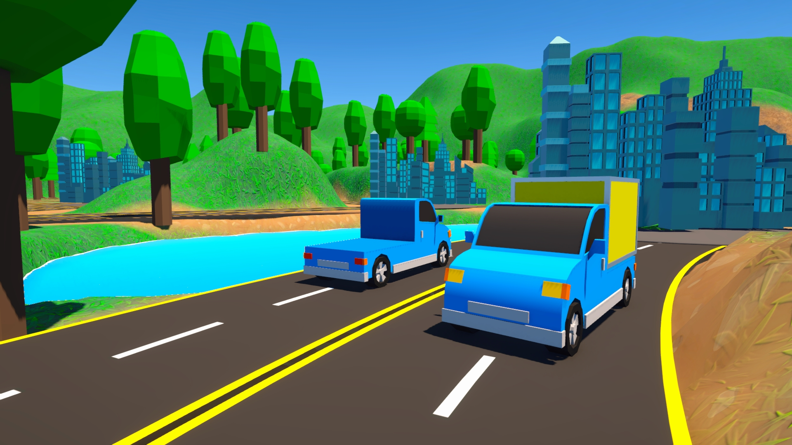
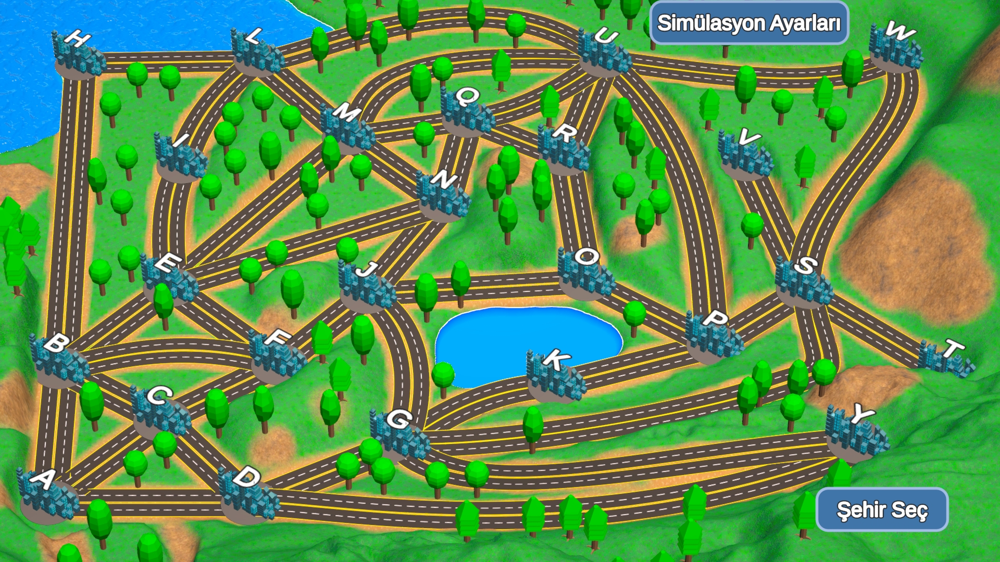
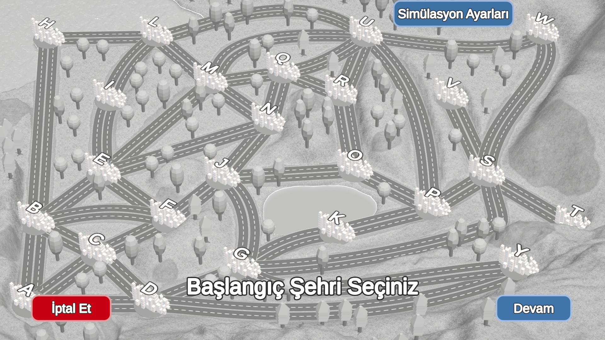
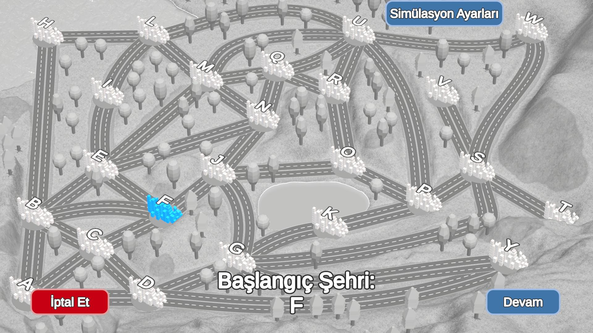
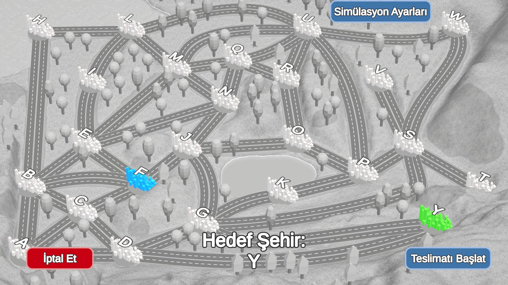
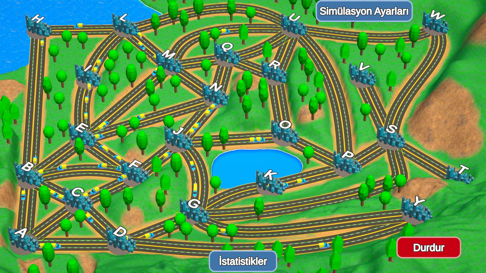
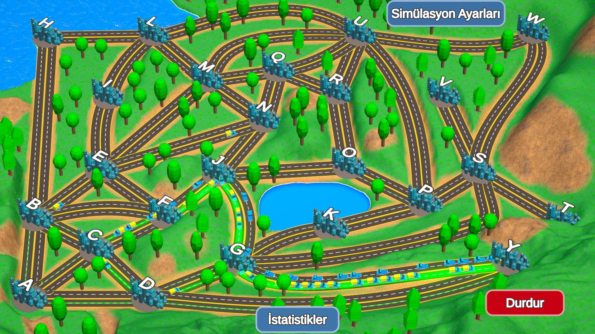
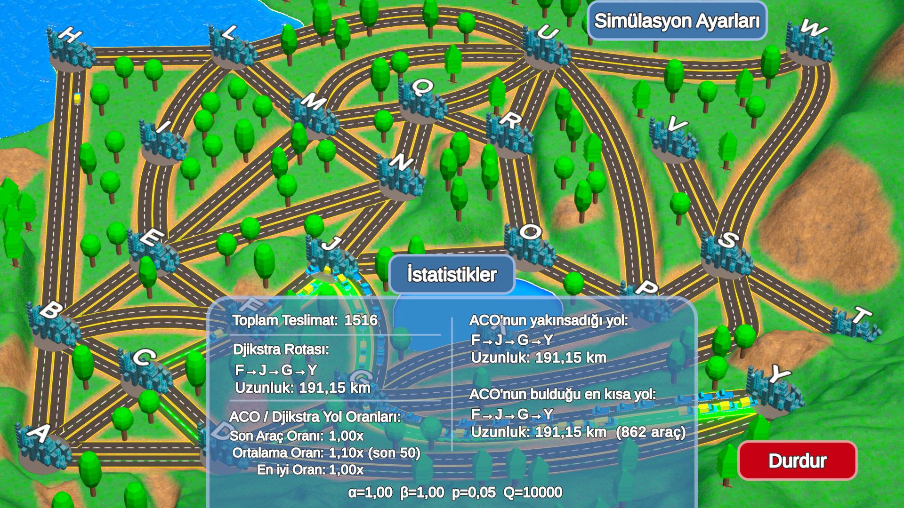
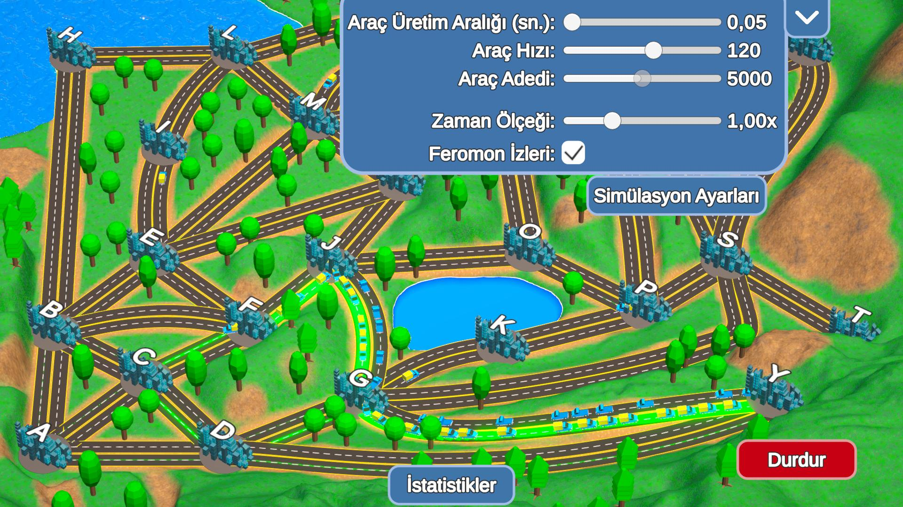
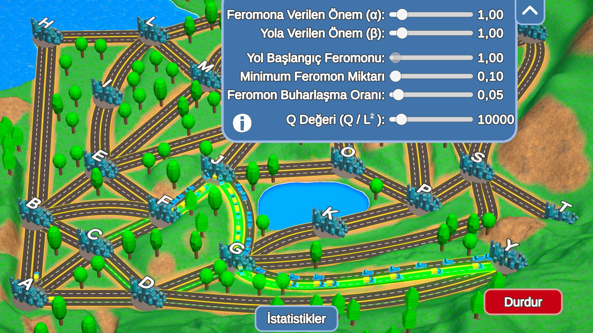

# ACO-Dijkstra Cargo Simulation

  
   

This project is a cargo delivery simulation based on ACO-Dijkstra algorithms. It takes approach to shortest path finding problem on city map that consists of 24 city, in other words: nodes. Each city has multiple neighbour cities and roads(i.e. edge - back and forth) that connect each other.

  
   
  <em>City map</em>

## How does it work?

The observer selects a start and target city by order. After selection is complete, observer initiates a simulation run.

  
   
  <em>Before selection</em>

  
   
  <em>Selecting start city</em>

  
   
  <em>Selecting target city</em>

During the run, vehicles start being generate at start city and travel to cities across the map with ACO algorithm until they find the target city. Once find the target they leave pheromone substance on the roads that used during traveling to target and return to the start city, using dijkstra algorithm.

  
   
  <em>First situation of run, cargo vehicles are discovering the route</em>

  
   
  <em>Final situtation, most cargo vehicles have learned the shortest route</em>

Dijkstra computes the shortest path from target to start before the initiation of run and has nothing to do with pheromones. ACO in other hands, it does not know the shortest path and tries to learn it with discovery, considering pheromones and road distances. The run stops when the max vehicle count is reached, or can be stopped by observer's desire any moment. All runs are being recorded and can be monitored with statistics panel.

  
   
  <em>Statistics panel: Dijkstra route, ACO/Dijkstra ratios, ACO converged and best route, Alpha-Beta-Evaporation rate-Q values</em>

The observer can change all cargo vehicle's behaviour with vehicle and ACO parameters; these settings affect the herd behaviour.

## Vehicle settings

* Vehicle spawn interval
* Vehicle speed
* Vehicle count
* Time scale
* Pheromone trails

  
   
  <em>Vehicle settings</em>

## ACO settings

* Pheromone weight (alpha)
* Distance weight (beta)
* Initial pheromone level
* Minimum pheromone amount
* Pheromone evaporation rate
* Q value

  
   
  <em>ACO settings</em>

---

If you have any questions about project, contact me via linkedin (furkanyldz0).